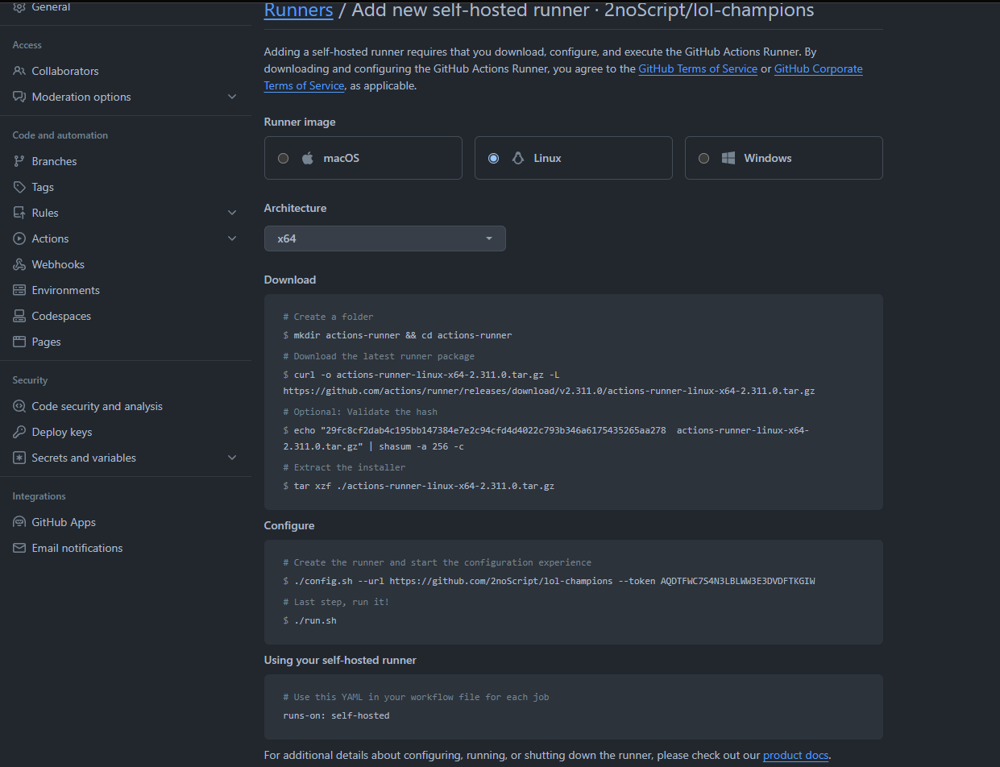
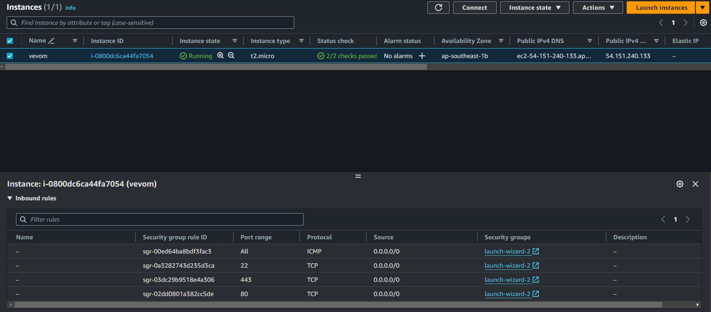
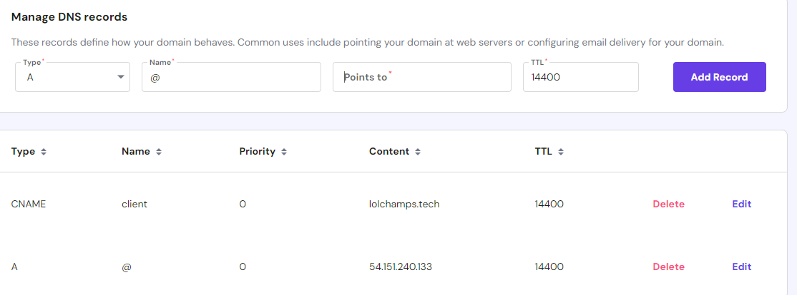
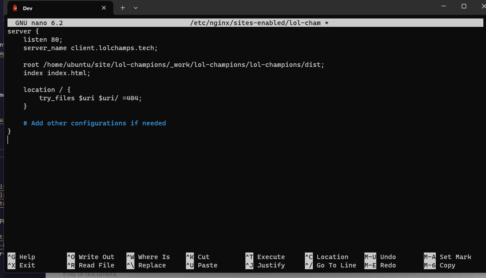
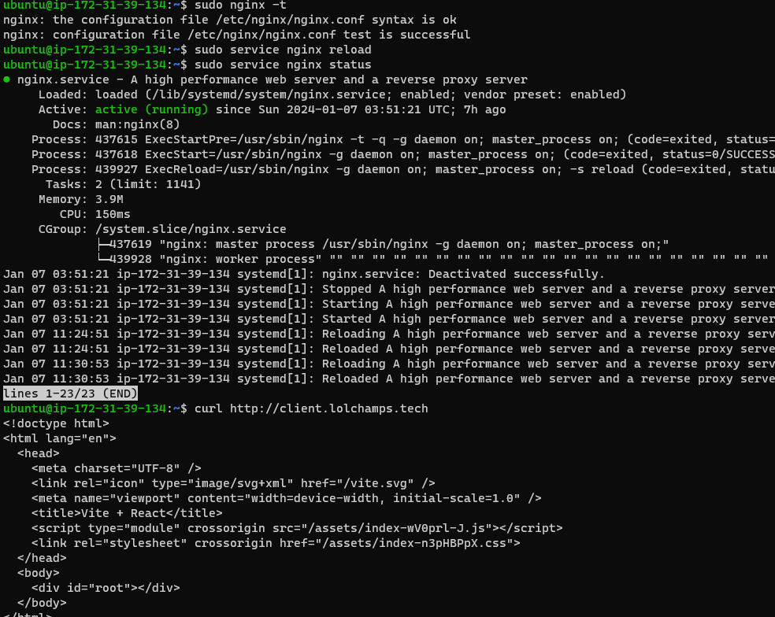
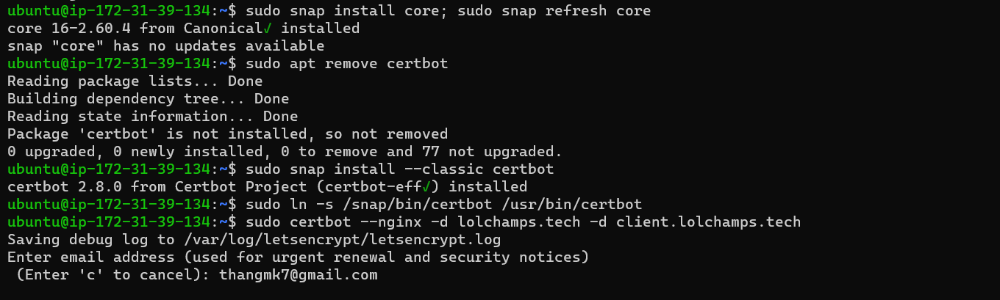
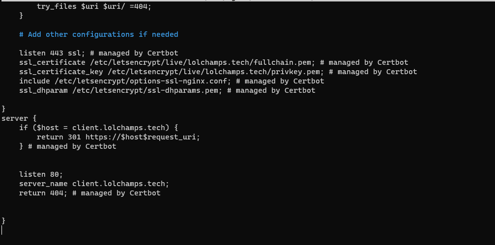

#### step 1 : React App + vite + yarn

<div>

</div>

- .github/workflow/node.js.yml

```yml
name: Node.js CI

on:
  push:
    branches: ["main"]

jobs:
  build:
    runs-on: self-hosted

    strategy:
      matrix:
        node-version: [18.x]

    steps:
      - uses: actions/checkout@v3
      - name: Set Permissions
      - name: Use Node.js ${{ matrix.node-version }}
        uses: actions/setup-node@v3
        with:
          node-version: ${{ matrix.node-version }}
          cache: "npm"
      - run: yarn install --frozen-lockfile
      - run: yarn build
```

#### step 2 : ubuntu + nginx + domain

> **1 Create instance ubuntu 22.04**

  

---

> **2 Configure domain name with public ip**

  

---

> **3 Setup nginx**

  <div>
    
    
  </div>

---

> **4 config ssl with certbot**

<div>
      
      
</div>

#### Demo react app

- <a href='https://client.lolchamps.tech'>https://client.lolchamps.tech</a>

#### Reference

- Setup <a href='https://www.digitalocean.com/community/tutorials/how-to-install-nginx-on-ubuntu-20-04'>Nginx</a>
- Setup <a href='https://docs.github.com/en/actions'>Github action</a>
- Setup <a href='https://www.digitalocean.com/community/tutorials/how-to-secure-nginx-with-let-s-encrypt-on-ubuntu-22-04'>certbot</a>
- Instructions <a href='https://www.hostinger.vn/huong-dan/cac-lenh-co-ban-trong-linux'>commands linux</a>
- Tool <a href='https://www.dnswatch.info/dns/dnslookup?la=en&host=lolchamps.tech&type=A&submit=Resolve'>DNS watch</a>
